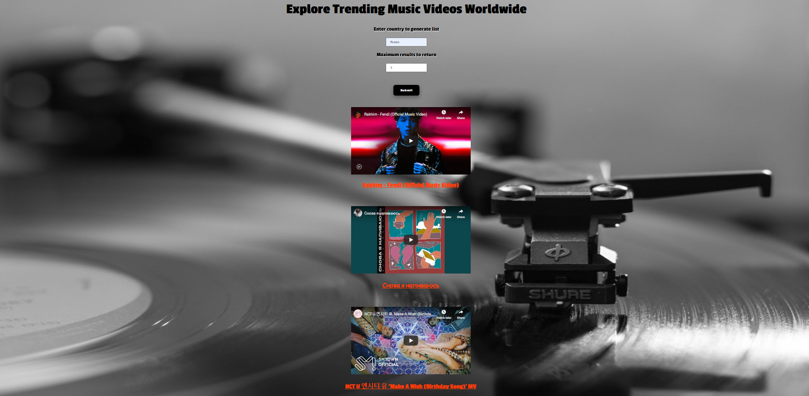

SoundScout

The SoundScout web app lets users generate a list of trending YouTube music videos from any country of their choosing. Users can watch the videos directly on the web app, without needing to follow links to Youtube.

You can access the app here: https://kyleeriss.github.io/SoundScout/

Landing page:

Video list:

Technology used: HTML, CSS, JavaScript, jQuery

